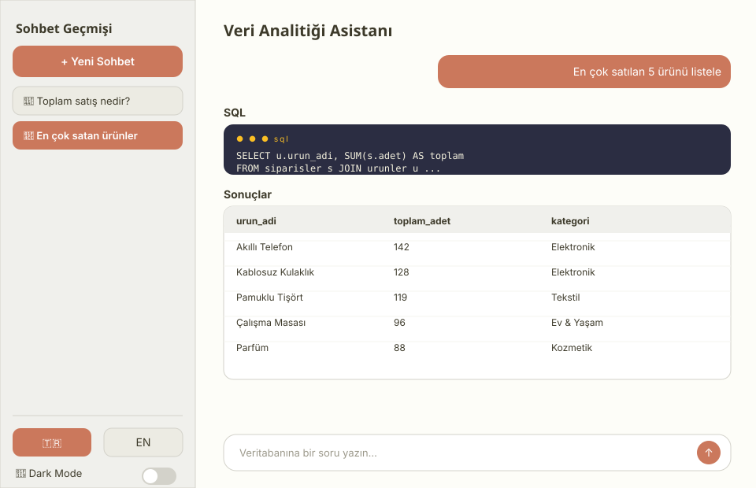
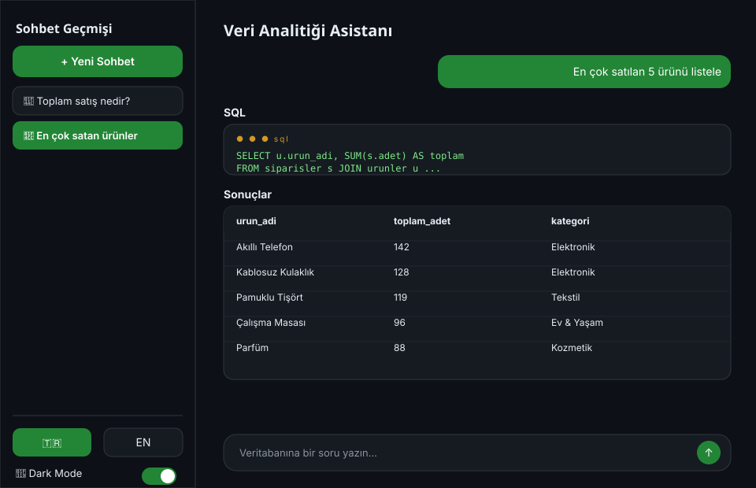

# 🤖 Yapay Zeka Destekli SQL / Veri Analitiği Asistanı (Text-to-SQL)

Bu proje, kullanıcıların veritabanlarına doğal dilde (Türkçe) sorular sormasını sağlayan ve arka planda bu soruları geçerli SQL sorgularına dönüştürüp sonuçları interaktif bir web arayüzünde sunan açık kaynaklı bir yapay zeka asistanıdır.

## 🚀 Özellikler

* **Doğal Dil İşleme:** Kullanıcı karmaşık SQL komutları bilmek zorunda kalmadan günlük dilde sorular sorabilir.
* **Dinamik Şema Okuma:** Veritabanı şemasını (tablolar, kolonlar, ilişkiler) otomatik olarak analiz eder.
* **Modern Web Arayüzü:** Streamlit sayesinde kullanıcı dostu, hızlı ve şık bir deneyim sunar.
* **İnteraktif Veri Gösterimi:** Pandas entegrasyonu ile veritabanı çıktılarını düzenlenebilir ve incelenebilir DataFrame (tablo) formatında ekrana yansıtır.
* **Çoklu Dil Desteği:** Arayüz Türkçe ve İngilizce olarak kullanılabilir.
* **Sohbet Geçmişi:** Sorulan sorular ve üretilen sorgular oturumlar halinde saklanır.

## 🛠️ Kullanılan Teknolojiler

* **Dil / Ortam:** Python 3.11+ (3.12 önerilir)
* **LLM (Büyük Dil Modeli):** Google Gemini — `gemini-flash-latest`
* **Orkestrasyon:** LangChain
* **Web Arayüzü:** Streamlit
* **API:** FastAPI
* **Veri Analizi:** Pandas
* **Veritabanı:** SQLite

## ⚙️ Kurulum ve Çalıştırma

Projenin yerel bilgisayarınızda çalışabilmesi için aşağıdaki adımları sırayla takip edin:

### 1. Depoyu Klonlayın

```bash
git clone https://github.com/scgnumut/text-to-sql-asistani.git
cd text-to-sql-asistani
```

### 2. Sanal Ortam Oluşturun ve Aktifleştirin

```bash
python -m venv venv

# Windows için:
venv\Scripts\activate

# MacOS/Linux için:
source venv/bin/activate
```

> PyCharm kullanıyorsanız bu adımı IDE de yapabilir: **File → Settings → Python Interpreter → Add Interpreter → Virtualenv Environment**.

### 3. Gerekli Kütüphaneleri Yükleyin

```bash
pip install -r requirements.txt
```

Kurulum internet hızına göre birkaç dakika sürebilir; LangChain ve Streamlit çok sayıda alt bağımlılık indirir.

### 4. Çevresel Değişkenleri Ayarlayın

`.env.example` dosyasını kopyalayarak kendi `.env` dosyanızı oluşturun:

```bash
cp .env.example .env
```

Ardından `.env` dosyasını açıp kendi Google Gemini API anahtarınızı yazın:

```env
GEMINI_API_KEY=buraya_kendi_keyinizi_girin
```

Anahtarı [Google AI Studio](https://aistudio.google.com/app/apikey) üzerinden ücretsiz olarak alabilirsiniz. `.env` dosyası `.gitignore` içinde olduğu için depoya yüklenmez; her kullanıcının kendi anahtarını tanımlaması gerekir.

### 5. Veritabanını Oluşturun

Veritabanı dosyaları (`.db`) güvenlik ve boyut nedeniyle `.gitignore` içinde yer alır, yani depoyu indiren kişinin veritabanını kendi bilgisayarında oluşturması gerekir.

**Önce proje kökünde `data` adında bir klasör oluşturun.** Git boş klasörleri takip etmediği için bu klasör depoyla birlikte gelmez; yoksa `unable to open database file` hatası alırsınız.

```bash
mkdir data
python src/database/seeder.py
```

Bu komut `data/eticaret_analiz.db` dosyasını oluşturur ve 3 tablo ile örnek kategori, ürün ve 200+ sipariş verisini ekler. Sohbet geçmişi veritabanı (`data/sohbet_gecmisi.db`) uygulama ilk açıldığında otomatik oluşturulur.

### 6. Uygulamayı Başlatın

```bash
streamlit run src/frontend/app.py
```

Uygulama `http://localhost:8501` adresinde açılır. İlk çalıştırmada Streamlit e-posta adresi sorar; boş bırakıp Enter'a basabilirsiniz.

## 🩺 Sorun Giderme

| Hata | Sebebi ve Çözümü |
| :--- | :--- |
| `unable to open database file` | Proje kökünde `data` klasörü yok. Klasörü oluşturup `seeder.py` dosyasını tekrar çalıştırın. |
| `no such table: sessions` | Sohbet geçmişi tabloları oluşturulmamış. Uygulamayı yeniden başlatın; `init_db()` açılışta tabloları oluşturur. |
| `404 NOT_FOUND: This model ... is no longer available` | Kullanılan Gemini modeli kapatılmış. `src/backend/llm_manager.py` içindeki `model` değerini güncel bir modelle (örn. `gemini-flash-latest`) değiştirin. |
| `GEMINI_API_KEY bulunamadı` | `.env` dosyası proje kökünde değil ya da adı yanlış (`.env.txt` gibi). Dosya adını ve konumunu kontrol edin. |
| Kurulum çok uzun sürüyor / paket derlenmeye çalışıyor | Python sürümünüz çok yeni olabilir. Sanal ortamı Python 3.12 ile yeniden oluşturmayı deneyin. |

## 📸 Ekran Görüntüleri

Kodu indirmeden arayüzün nasıl göründüğünü merak ediyorsanız, uygulamanın açık ve koyu tema (light / dark mode) örnek görünümleri aşağıdadır:

| 🌞 Açık Tema (Light Mode) | 🌙 Koyu Tema (Dark Mode) |
| :---: | :---: |
|  |  |

Arayüz, sol taraftaki sohbet geçmişi paneli, 🇹🇷 / EN dil seçimi ve 🌙 Dark Mode geçişi ile birlikte gelir; sağ tarafta ise üretilen SQL sorgusu ve sonuç tablosu gösterilir.

## 📂 Proje Yapısı

```
text-to-sql-asistani/
├── src/
│   ├── frontend/              # Streamlit arayüzü
│   │   ├── app.py
│   │   ├── assets/            # Arayüz görselleri
│   │   └── i18n/              # Türkçe / İngilizce çeviriler
│   ├── backend/               # LLM ve LangChain mantığı
│   │   └── llm_manager.py
│   ├── database/              # Veritabanı işlemleri
│   │   ├── chat_db.py         # Sohbet geçmişi yönetimi
│   │   └── seeder.py          # Test verisi üreticisi
│   ├── config/                # Yol ve dil ayarları
│   │   └── settings.py
│   └── api/                   # FastAPI REST servisi
│       └── main.py
├── data/                      # SQLite veritabanı dosyaları (elle oluşturulur)
│   ├── eticaret_analiz.db
│   └── sohbet_gecmisi.db
├── tests/                     # Birim testler
├── .streamlit/                # Streamlit yapılandırması
├── .env.example               # Örnek çevresel değişken şablonu
├── .env                       # Gizli API anahtarları (gitignore'da)
├── start_app.bat              # Windows başlatma scripti
├── README.md                  # Proje açıklaması
└── requirements.txt           # Proje bağımlılıkları
```

## 🚀 API Sunucusu

Proje, FastAPI ile bir REST API sunucusu da içerir. API dokümantasyonu Scalar ile `/docs` endpoint'inde sunulur.

**API sunucusunu başlatmak için:**

```bash
python -m uvicorn src.api.main:app --reload --host 0.0.0.0 --port 8000
```

**Erişim:**

- API dokümantasyonu: `http://localhost:8000/docs`
- Sağlık kontrolü: `http://localhost:8000/health`
- Sorgu endpoint'i: `POST http://localhost:8000/ask`
- Şema endpoint'i: `GET http://localhost:8000/schema`

**Örnek kullanım:**

```bash
curl -X POST "http://localhost:8000/ask" \
  -H "Content-Type: application/json" \
  -d '{"question": "Toplam kaç tane sipariş var?"}'
```

## 💡 Örnek Sorular

Uygulama açıldıktan sonra deneyebileceğiniz sorular:

- Toplam kaç tane sipariş var?
- En çok satan 5 ürün hangileri?
- Kategorilere göre toplam ciro nedir?
- Stoğu 10'un altında olan ürünleri listele.

---

*Bu proje açık kaynak kodlu olarak geliştirilmiştir.*